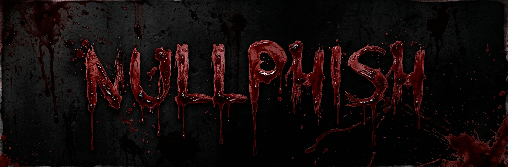

<!-- NullPhish -->

<p align="center">
   
</p>

<p align="center">
  
  
  
  
  
</p>

<p align="center">
  
  
  
  
</p>

<p align="center">
  <b>An automated phishing toolkit for security research, with 30+ templates, with discord and telegram integration.</b>
</p>

---

<h3 align="center">Disclaimer</h3>

<i>

Any actions and/or activities related to <b>NullPhish</b> are solely your responsibility.

The misuse of this toolkit may result in criminal charges being brought against the individuals involved. The contributors will not be held responsible in the event that any criminal charges are brought against anyone misusing this toolkit to break the law.

<b>This toolkit contains materials that can be potentially damaging or dangerous for social media.</b> Refer to the laws in your province/country before accessing, using, or otherwise utilizing this project in an improper manner.

<b>This tool is made for educational purposes only.</b> Do not attempt to violate the law with anything contained here.

It only demonstrates "how phishing works". <b>You shall not misuse the information to gain unauthorized access to someone's social media accounts.</b>

Use at your own risk.

</i>

Previously a fork of Zphisher, now maintained as a standalone repository.

---

## Features

* Latest and updated login pages
* Beginner friendly
* Multiple tunneling options

  * Localhost
  * Cloudflared
  * Serveo
  * Localhost.run
  * Pinggy
  (Automatic fallback to Cloudflared if any fails)
* Mask URL support
* Docker support

---

## Installation

Clone this repository:

```bash
git clone --depth=1 https://github.com/r4tur1/NullPhish.git
```

Go to the cloned directory and run:

```bash
cd NullPhish
bash nullphish.sh
```

On first launch, dependencies will be installed automatically.

---

## Installation (Termux)

```bash
pkg install unstable-repo
pkg install nullphish
nullphish
```

> **Termux discourages hacking** — never discuss anything related to this tool in Termux discussion groups.

See: https://wiki.termux.com/wiki/Hacking

---

## Installation via `.deb`

Download the `.deb` packages from the latest release.

For **Termux**, download the `*_termux.deb` variant.

Install using:

```bash
apt install <path-to-deb-file>
```

or:

```bash
dpkg -i <path-to-deb-file>
apt install -f
```

---

## Run on Docker

Pull the image:

### DockerHub

```bash
docker pull r4tur1/nullphish:latest
```

### GHCR

```bash
docker pull ghcr.io/r4tur1/nullphish:latest
```

Using the wrapper script:

```bash
curl -LO https://raw.githubusercontent.com/r4tur1/NullPhish/master/run-docker.sh
bash run-docker.sh
```

Temporary container:

```bash
docker run --rm -ti r4tur1/nullphish
```

> Remember to mount the `auth` directory.

---

<details>
<summary><b>Dependencies</b></summary>

<br>

**NullPhish** requires:

* `git`
* `curl`
* `php`
* `ssh`
* `unzip`

> All dependencies are installed automatically on first run.

</details>

<br>

<details>
<summary><b>Tested On</b></summary>

<br>

* Ubuntu
* Debian
* Arch
* Manjaro
* Fedora
* Termux

</details>

---

<h3 align="center"><i>Workflow</i></h3>

<p align="center">
  
</p>

---

## 🚧 Development Roadmap

### Core Features

| Feature                     | Status      |
| --------------------------- | ----------- |
| Discord Webhook Integration | ✅ Completed |
| Telegram Integration        | ✅ Completed |

<details>
<summary><b>🔄 Template Refresh Progress</b></summary>

<br>

### Completed Updates

```text
adobe • badoo • discord • dropbox • instagram
```

### Pending Updates

```text
ebay • facebook • fb_advanced • fb_messenger • fb_security
github • gitlab • google • google_new • google_poll
ig_followers • ig_verify • insta_followers • linkedin
mediafire • microsoft • netflix • paypal • pinterest
playstation • protonmail • quora • reddit • roblox
snapchat • spotify • steam • tiktok • twitch
twitter • xbox • yahoo
```

</details>

<br>

### ✨ New Templates Added

| Template  | Status  |
| --------- | ------- |
| epicgames | ✅ Added |
| icloud    | ✅ Added |
| onlyfans  | ✅ Added |
| patreon   | ✅ Added |
| riotgames | ✅ Added |
| zoom      | ✅ Added |

### 🗑️ Deprecated Templates

Removed due to low usage:
 
```text
devianart • origin • vk • vk-poll • wordpress • yandex
```

---

## Credits

<p>
NullPhish is based on <b>Zphisher</b> by <b>htr-tech (Tahmid Rayat)</b>, licensed under GPL-3.0.
All original contributors of Zphisher are acknowledged.
</p>


---

## Find Me On

<p align="left">
  <a href="https://github.com/r4tur1" target="_blank">
    
  </a>
</p>
